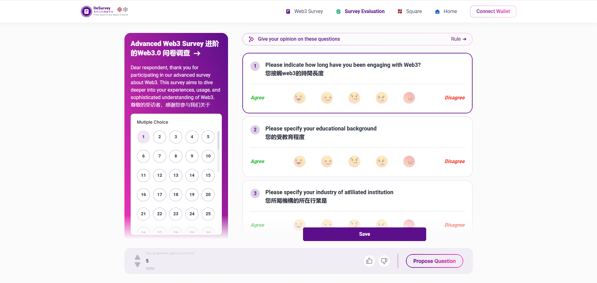

# deSuvery - web3 问卷平台

[http://81.68.96.163:5002/](http://81.68.96.163:5002/)

::: info 项目说明
填写问卷获得积分，消耗积分铸造 NFT 和发布问卷  
负责前端开发,后端开发
:::

::: tip 技术栈
前端基于 nuxt2\(vue2\) 构建  
使用 scss/ elementui/ swiper/  
后端基于 fastify.js  
使用 node-xlsx /moongoose / AWS S3
:::
