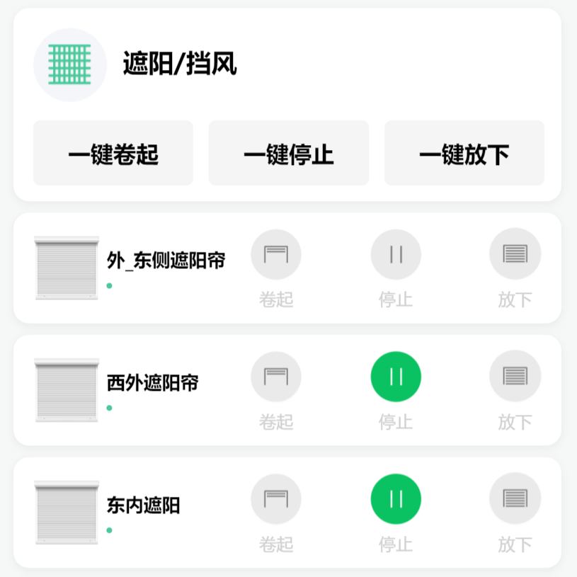
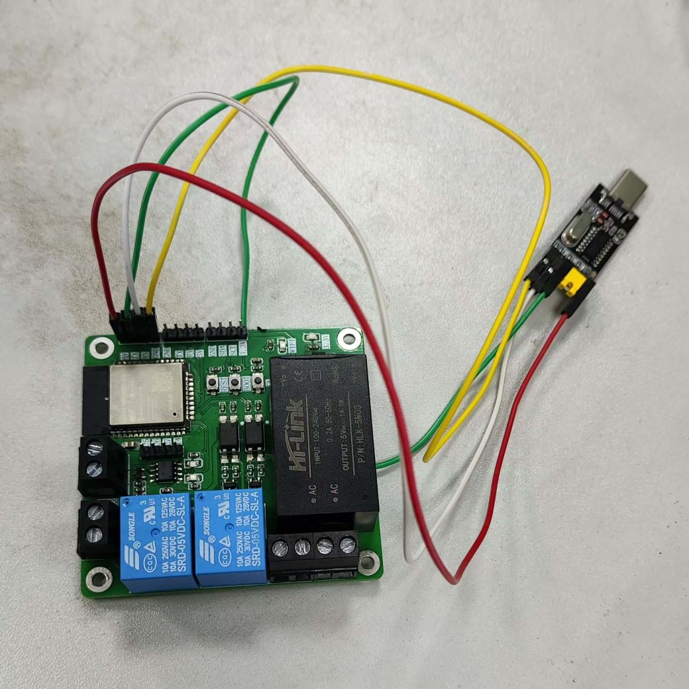

# 理想花园 - 物联网小程序

    

        
    

    

        
    

::: info 项目说明
通过小程序远程控制继电器驱动花园中设备，查看传感器数据  
负责小程序开发,嵌入式开发,
:::

::: tip 技术栈
小程序基于 uniapp 构建  
使用 uview 组件库  
嵌入式基于 esp32/arduino 开发，通过 mqtt 进行数据通讯  
空气温湿度传感器使用 dht11  
土壤湿度传感器使用 RS485/modbus  
光照传感器使用 BH1750  
使用 PubSubClient/ ArduinoJson/ nvs_flash/ Wire/ HardwareSerial
:::
